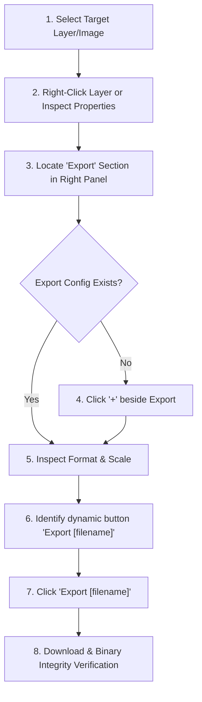

# Figma Asset Export

## 1. Purpose
The `figma-asset-export` skill establishes a deterministic, engineering-grade workflow for exporting and downloading authentic image assets (photos, graphics, 3D renders, vector icons) directly through the Figma web/desktop UI. 

It eliminates brittle automation, prevents accidental canvas screenshots, dynamically adapts to layer naming, and verifies file binary integrity upon download.

---

## 2. Trigger Conditions (When to Use)
Activate this skill whenever:
- An asset (photo, illustration, icon, 3D render, badge, or banner) inside a Figma canvas needs to be exported for web/app implementation.
- You are interacting with Figma via browser automation / CDP / GUI agent tools and need to extract the clean graphic file.
- Direct image fill hashes are inaccessible or when layers/vectors/groups require rendered export (PNG, SVG, JPG, PDF) using Figma's native rendering engine.

### When NOT to use:
- **Never** screenshot the Figma canvas, selection boxes, or viewport to use as an asset.
- **Do not** use if a direct uncompressed source file is already stored in the local codebase.

---

## 3. Prerequisites
1. **Figma Canvas Open**: Target document loaded in browser/app with edit or inspect permissions.
2. **Target Identification**: Clear knowledge of the layer, component, frame, or vector element to export.
3. **Download Destination**: Defined target directory (e.g. `public/assets/` or `src/assets/`).

---

## 4. UI Workflow & Step-by-Step Execution

### Step 1: Select the Target Image/Layer
- Click on the intended asset layer or select it from the Layers panel (left sidebar).
- Visually confirm the bounding box highlights the exact graphical element (and not an unwanted parent container or overlay).

### Step 2: Open Contextual UI / Navigate to Properties
- Right-click the selected object to open the contextual menu, OR inspect the right-hand **Properties / Design / Inspect** sidebar.

### Step 3: Locate the "Export" Section
- Scroll to the bottom of the right-hand sidebar where the **Export** section resides.

### Step 4: Add Export Configuration (Click "+")
- If no export preset is active, click the **`+`** button situated to the right of the "Export" heading.
- Figma generates a default export row (e.g., `1x`, `PNG`, suffix empty).

### Step 5: Format & Scale Validation
- Validate the export format (defaulting to the existing design config: `PNG`, `JPG`, `SVG`, `PDF`).
- Do not arbitrarily modify the format unless requested (e.g., `@2x` for Retina displays or `SVG` for icons).

### Step 6: Identify the Dynamic Export Button
- Locate the action button at the bottom of the Export section.
- The button label follows the dynamic pattern: **`Export [LAYER_NAME]`** (e.g. `Export slide_ahc_1111_poster`, `Export image 10`, `Export Frame 4`).

### Step 7: Trigger Export
- Click the dynamic **`Export [LAYER_NAME]`** button.

### Step 8: Download & Binary Verification
- Await file write to disk.
- Verify that the downloaded file is a genuine binary image (>10 KB, valid Magic Bytes `\x89PNG`, `\xFF\xD8\xFF`, or `<svg`), and NOT an HTML login redirect.

---

## 5. UI State Model

| State | Name | Visual Indicator / Expected UI | Action Required |
|:---|:---|:---|:---|
| **State 1** | `IMAGE_SELECTED` | Bounding box around asset; layer active in Layers panel | Verify target is correct layer, not empty wrapper |
| **State 2** | `PROPERTIES_VISIBLE` | Right panel shows Design/Inspect tabs; Export group reachable | Scroll right panel to bottom |
| **State 3** | `CONFIG_ACTIVE` | Row showing scale (`1x`/`2x`) and format (`PNG`/`SVG`) | Click `+` if row is missing |
| **State 4** | `BUTTON_READY` | Action button `Export <name>` visible with high contrast | Read label text to confirm target name |
| **State 5** | `DOWNLOAD_COMPLETE`| Browser download prompt finishes or file written to disk | Verify file size and binary header |

---

## 6. Interaction Strategy (Anti-Brittle Guidelines)

1. **Semantic & Text-First Matching**:
   - Prefer finding elements by aria-label, visible text (`"Export"`, `"+"`), or accessible roles over raw pixel coordinates `(x, y)`.
2. **Relative Anchoring**:
   - When searching for the `+` button, anchor it to the sibling element containing text `"Export"`.
3. **Dynamic Layer Name Handling**:
   - Never regex match an exact hardcoded string like `Export speaker.png`.
   - Match using pattern: `/Export\s+(.+)/i`.
4. **Visual Verification Checkpoints**:
   - After right-click / selection → Verify bounding box.
   - After clicking `+` → Verify export config row appeared.
   - Before clicking Export → Verify button label matches target.
   - After clicking Export → Verify download completion.

---

## 7. Error Handling & Recovery Matrix

| Scenario | Symptom / Root Cause | Recovery Action |
|:---|:---|:---|
| **Case A** | Image not selected | Reselect layer in Canvas or double-click into group to reach leaf layer. |
| **Case B** | Right-click menu does not show Export | Navigate directly to the right-hand Properties panel and scroll to bottom. |
| **Case C** | Export section exists but `+` is missing | An export preset already exists; proceed directly to clicking the Export button. |
| **Case D** | Clicked `+` but export button did not appear | Refresh panel scroll position; verify layer is not locked or hidden. |
| **Case E** | "Export [name]" button missing | Ensure zoom level / sidebar width is adequate; re-trigger panel redraw. |
| **Case F** | Export button clicked but file is HTML / 0 KB | Session cookie missing or blocked; use direct browser download context with session credentials. |
| **Case G** | Wrong layer selected | Press `Esc` or click outside, then re-select specific layer in Layers tree. |
| **Case H** | Container/Frame selected instead of image | Drill down (double click or `Cmd/Ctrl + Click`) to select the inner image/fill layer. |

---

## 8. Multi-Asset Extension (Batch Export Protocol)

To export multiple assets systematically:
1. **Multi-Select in Layers Panel**: Hold `Shift` / `Cmd` to select multiple target components or frames.
2. **Batch Export Setup**: With all target layers selected, click `+` in the Export section to apply export presets across all selections simultaneously.
3. **Batch Trigger**: The button updates to **`Export [N] layers`** (e.g. `Export 12 layers`).
4. **Zip / Multi-file Unpack**: Download the exported archive/files, unpack into `public/assets/`, and verify all files against the project asset manifest.

---

## 9. Verification Checklist

- [ ] Target graphic selected cleanly (no outer UI frames).
- [ ] Export format matches design specification (`PNG`, `SVG`, `JPG`, `WebP`).
- [ ] Scale set appropriately (`1x` standard, `2x` for crisp Retina/4K displays).
- [ ] Button `Export [name]` clicked cleanly.
- [ ] File verified on filesystem:
  - File exists in destination folder.
  - File size > 10 KB.
  - File starts with valid binary header (`\x89PNG`, `\xFF\xD8\xFF`, etc.) and contains NO HTML tags.
- [ ] Asset imported and rendered cleanly in the web application.
